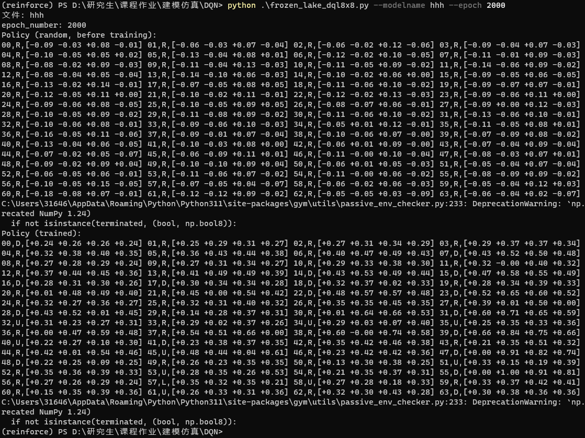

# 使用Agent探索迷宫

## 训练环境设计

使用Gym提供的FrozenLake，该环境为光滑的冰面，冰面上有不可穿越的冰洞，智能体需要从左上角走到右下角，在智能体移动时由于冰面光滑会向前进方向的左右随机滑动。


将光滑属性关闭并扩展地图至8x8，可以模拟迷宫环境。

状态空间为64

动作空间为4：

- 0: LEFT
- 1: DOWN
- 2: RIGHT
- 3: UP

回报：

- 到达终点：1
- 掉进洞里：0
- 其他：0

可以生成随机地图，也可以自己设计地图，导入方式如下：

```python
mapmap0 = [
    "SHFFFFHF",
    "FFFHFHFF",
    "FHHHFFFF",
    "FHHHFFHF",
    "FFFFHHFF",
    "HFFHHHFF",
    "FHHHFFFH",
    "FFFHHFFG"
]
env = gym.make('FrozenLake8x8-v1',is_slippery=False,desc=mapmap1)
```

## 代码描述

**QLtest.py** 使用Q-Learning方法探索迷宫，将学习到的Q表保存为npy文件。

**WrapperQLtest.py** 对gym提供的环境进行了封装，修改了价值函数，掉进冰洞或原地不动会有惩罚，但是冰洞数量多时会错误收敛。

**frozen_lake_dql8x8.py** 使用Deep-Q-Learning方法探索迷宫，将学习到的神经网络保存为pt文件。

`class DQN(nn.Module)`定义了一个两层的神经网络，输入维度为状态空间数，输出维度为动作空间数，隐藏层维度为状态空间数。

`class ReplayMemory()`用于存储和重放经验。

`class FrozenLakeDQL()`定义了超参数，训练方法，测试方法，模型保存方法。

Deep-Q-Learning的伪代码表述如下：

```
初始化 Q 神经网络 Q(s, a; θ) 和目标网络 Q_target(s', a'; θ_target) 参数 θ 和 θ_target
初始化经验回放记忆体 D
初始化状态 s

对于每一轮 episode:
    初始化累积奖励 total_reward
    获取初始状态 s
    对于每一步 t in 步数上限:
        使用 ε-greedy 策略选择动作 a
        执行动作 a 并观察新状态 s', 奖励 r, 以及是否终止 done

        将(s, a, r, s', done)存储到经验回放记忆体 D 中

        从 D 中采样小批量经验 (s_batch, a_batch, r_batch, s'_batch, done_batch)

        计算目标值 target:
        如果 s' 不是终止状态:
            target = r_batch + γ * max(Q_target(s'_batch, a'; θ_target))
        否则:
            target = r_batch

        更新 Q 网络的参数 θ:
        Loss = 计算 Q 网络的损失函数(target, Q(s_batch, a_batch; θ))
        通过反向传播和优化算法更新网络权重

        每隔一定步数更新目标网络 Q_target 的参数为 θ_target = θ

        更新状态 s = s'
        更新累积奖励 total_reward

        如果终止 done:
            跳出循环

```

## 命令行参数使用方法

```
def main():
    parser = argparse.ArgumentParser(description='FrozenLake DQL 参数化示例')
    parser.add_argument('--learning_rate', type=float, default=0.001, help='学习率 (alpha)')
    parser.add_argument('--discount_factor', type=float, default=0.9, help='折扣因子 (gamma)')
    parser.add_argument('--sync_rate', type=int, default=10, help='同步策略和目标网络的步数')
    parser.add_argument('--memory_size', type=int, default=1000, help='回放记忆体大小')
    parser.add_argument('--batch_size', type=int, default=32, help='从回放记忆体中抽取的训练数据集大小')
    parser.add_argument('--modelname', default="defaultpt",help='神经网络保存名')
    parser.add_argument('--epoch', default=3000,help='训练几轮')
    args = parser.parse_args()
```

使用 `argparse`模块，可以在命令行中来设置超参数

```
python .\frozen_lake_dql8x8.py --modelname hhh --epoch 2000 --learning_rate_a 0.001
```


## 效果

### 训练结果

输出训练前后神经网络的权重



平均奖励曲线(左)与随机因子减少曲线(右)


### 测试过程

见./images/testsvideo.mp4

